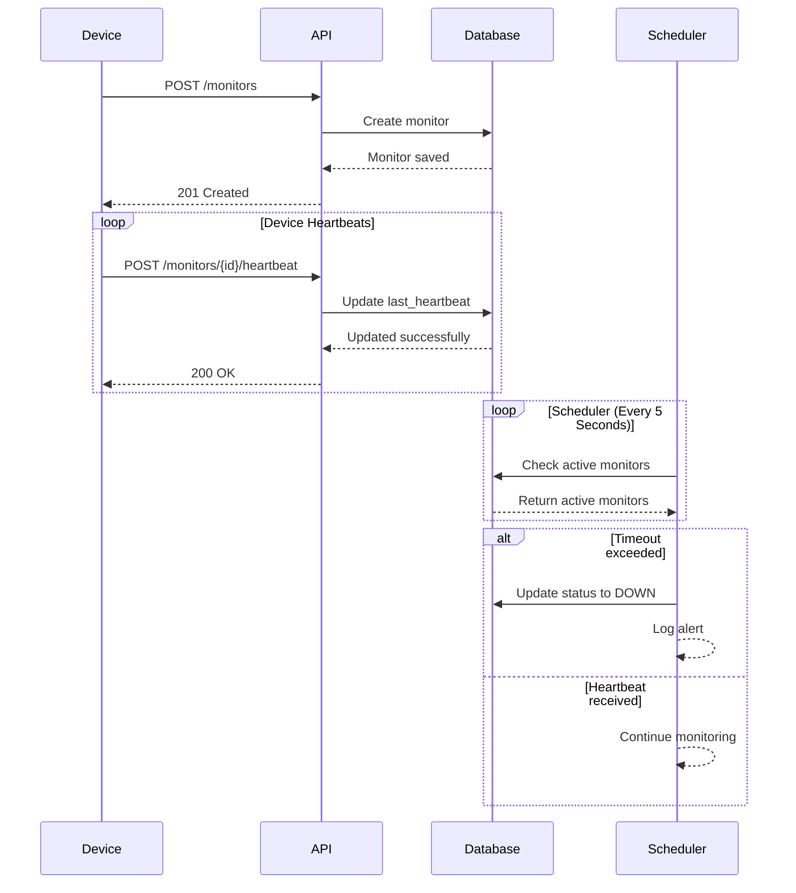
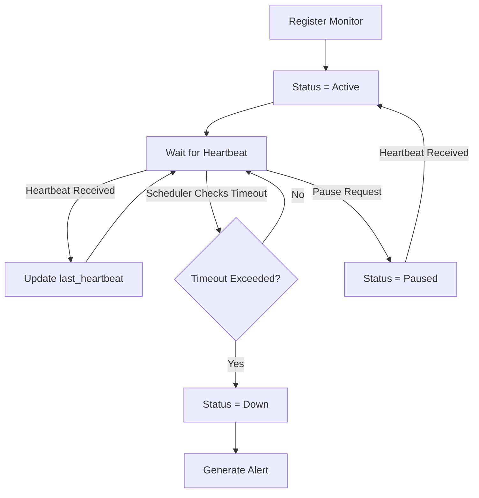

# Pulse Check API (Watchdog Sentinel)

A Django REST Framework backend service that implements a Dead Man's Switch for remote infrastructure monitoring.

Devices periodically send heartbeats to the API. If a heartbeat is not received before the configured timeout, the monitor is automatically marked as DOWN and an alert is generated.

## 1. Architecture Diagram




## System Flow



## Features

- Register a monitor
- Receive heartbeat signals
- Automatic countdown reset
- Automatic timeout detection
- Pause monitoring
- Resume monitoring on heartbeat
- Background scheduler
- Device status tracking
- RESTful API

## Tech Stack

- Python 3.13
- Django 6
- Django REST Framework
- APScheduler
- SQLite

## 2. Setup Instructions

- Clone the repository

    ```
   git clone https://github.com/Justice52/Pulse-Check-API.git
    ```
- Change directory 
    ```
    cd Pulse-Check-API
    ```
- Create virtual environment
    ```
    python -m venv venv
    ```

- Activate

    Windows
    ```
    venv\Scripts\activate
    ```
    Mac
    ```
    source venv/bin/activate
    ```
- Install dependencies

    ```
    pip install -r requirements.txt
    ```

- Run migrations

    ```
    python manage.py migrate
    ```

- Create superuser

    ```
    python manage.py createsuperuser
    ```

- Start server

    ```
    python manage.py runserver
    ```
- The API will be available at:

    ```
    http://127.0.0.1:8000/
    ```

## 3. API Documentation
- Register a Monitor

```POST /api/monitors```

Request
```
{
  "id": "device-123",
  "timeout": 60,
  "alert_email": "admin@critmon.com"
} 
```
Response

201 Created
```
{
  "message": "Monitor created successfully."
}
```
- Send Heartbeat

```
POST /api/monitors/{device_id}/heartbeat
```
Example
```
POST /api/monitors/device-123/heartbeat
```
Response

200 OK
```
{
  "message": "Heartbeat received.",
  "status": "active",
  "last_heartbeat": "2026-06-22T09:10:23Z"
}
```
- Pause Monitoring
```
POST /api/monitors/{device_id}/pause
```

Example
```
POST /api/monitors/device-123/pause
```
Response

200 OK

```
{
  "message": "Monitor paused successfully.",
  "status": "paused"
}
```

- List All Monitors (Developer's Choice)

```GET /api/monitors```

Response

200 OK
```
[

      {
        "id": "test1",
        "timeout": 10,
        "alert_email": "admin@test.com",
        "status": "down",
        "last_heartbeat": "2026-06-21T17:40:43.363039Z",
        "created_at": "2026-06-21T17:40:43.364175Z"
    },
    {
        "id": "device-123456",
        "timeout": 10,
        "alert_email": "admin@critmon.coooom",
        "status": "down",
        "last_heartbeat": "2026-06-21T17:37:41.937113Z",
        "created_at": "2026-06-21T17:37:41.937832Z"
    },
    {
        "id": "device-12345",
        "timeout": 10,
        "alert_email": "admin@critmon.cooom",
        "status": "down",
        "last_heartbeat": "2026-06-21T17:35:12.449548Z",
        "created_at": "2026-06-21T17:35:12.453403Z"
    },
]
```
- Get a Single Monitor (Developer's Choice)

```GET /api/monitors/{device_id}```

Example
```GET /api/monitors/device-123```
Response

200 OK
```
{
  "id": "device-123",
  "status": "active",
  "timeout": 60,
  "alert_email": "admin@critmon.com",
  "last_heartbeat": "2026-06-22T09:10:23Z",
  "created_at": "2026-06-22T09:00:00Z"
}
```

## 4. Developer's Choice

I have added monitor status endpoints where an administrator can get either all the registered monitors or one particular monitor.

The ability to observe this system will be made easier since you can observe the status of devices (ACTIVE, PAUSED, or DOWN) without looking at the database.

## Design Decisions

Rather than having a dedicated timer thread for each monitor, this application records the timestamp of the most recent heartbeat.

The background scheduler then regularly verifies whether the duration since the most recent heartbeat has exceeded the timeout duration.

This is far more scalable compared to keeping several thousand separate timers running and is reflective of how monitoring systems actually function in practice.
